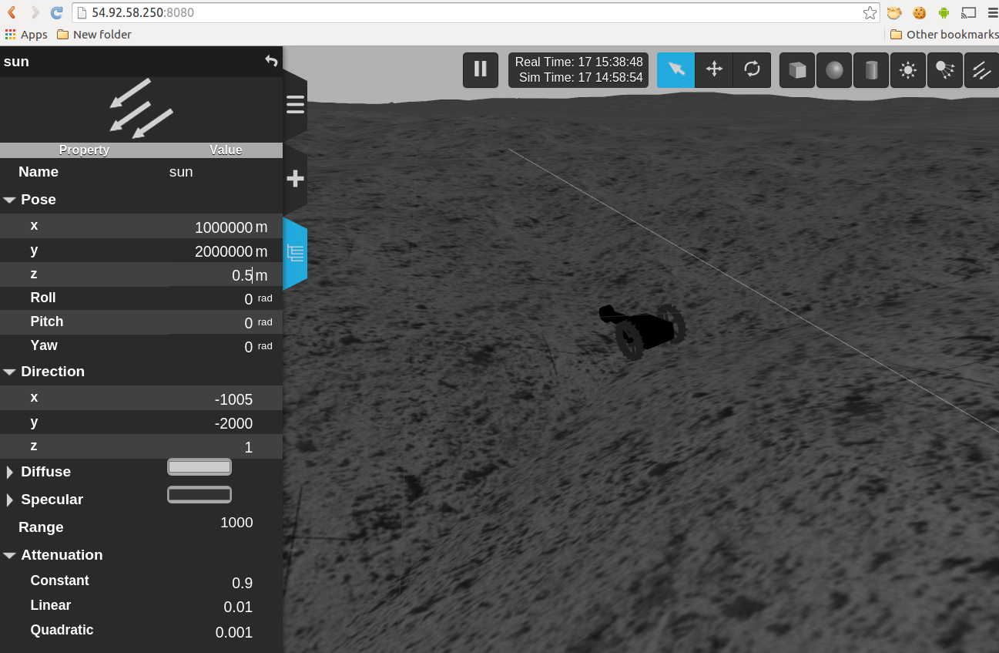
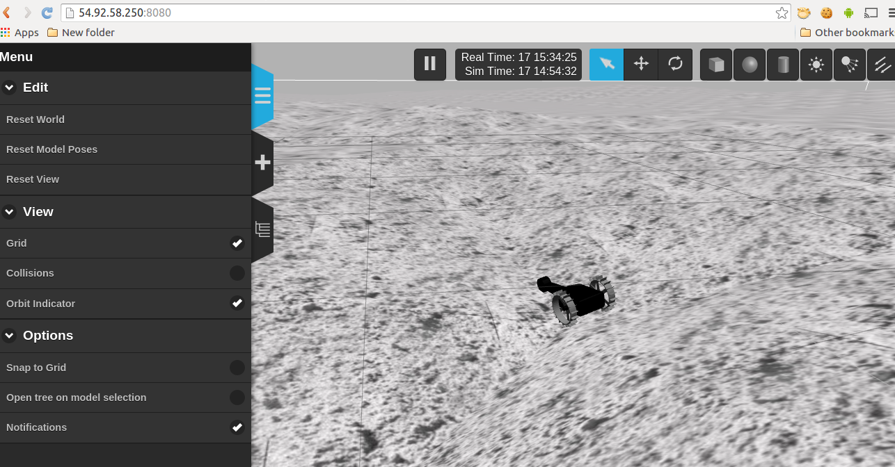

Hakuto ROS (Robot Operating System) simulation package
================================================================================================================================================

With this ROS package, we can realize `lunar rovers at Hakuto <http://team-hakuto.jp/team/rover>`_ in a simulated lunar surface on your web browser. This page is the end user's usage manual.

|hakuto_gzweb_dark|

Please see `installation and in-depth operation <./sysadmin.rst>`_ doc if you're:

 * system administrator responsible for install/maintainance work
 * developer 

.. contents:: Table of Contents
   :depth: 2
.. sectnum::

Operating System and Web Browser tested
======================================================

The simulator has been seen working on the following environment:

 * Mac OSX 10.10

   * Google Chrome 40.0
   * Firefox 35.0
 * Android 5.0.1

   * Google Chrome 40.0 

 * Ubuntu Linux (12.04 and 14.04)

   * Google Chromium 37.0 
   * Firefox 35.0

Under following circumstance the simulator limitedly works:

 * MS Windows 7 (64bit)

   * IE11

Simulator Basic Usage
========================

Simulator view
----------------

Users can access the simulator thru `this link <http://54.92.58.250:8080>`_ (*1).
You'll see simulator similar to the following image:

|hakuto_web_simulator_osx_ff|

Assigned keys vary per each OS and web browser. Typically you use `mouse buttons and wheel`, `Shift` key to control `Zoom`, `Tilt` and `Elevation`.

Keypad for simulator
------------------------

Then, users can send commands from another web page; open separate `this web page <http://54.92.58.250/joystick.html>`_. You'll see keys like below:

|hakuto_gzweb_keypad|

There you can use ***keyboard*** to send commands that are associated with each key. 
NOTE that the images in the web page are NOT buttons (they are there to indicate which keys are associated with what commands).

Simulator Advanced Usage
====================================

Modify environment
------------------------

|hakuto_gzweb_panel_sun|

Reset views
------------

Sometimes you want to "reset" the robot's pose, environment, and the view (where you're looking from at the simulation) to the initial status. 

Use the tab on the left side of the simulator |gzweb_tab_reset_view|.

Restart simulation
--------------------

At the time of writing (Mar 2015) there's no end-user feature to restart the simulation through web browser. Please either `reset` views, or contact the simulation system admins. See the troubleshooting.

Troubleshooting
================

The Hakuto web simulation is administered by `TORK <http://opensource-robotics.tokyo.jp/>`_, but this is subject to change. For now (Mar, 2015) any issues and requests can be contacted on `the issue tracker on github <https://github.com/tork-a/hakuto/issues>`_.

.. |hakuto_gzweb_dark| image:: https://cloud.githubusercontent.com/assets/493276/10970279/ecbde300-8410-11e5-9034-c33354ce7357.png
.. |hakuto_web_simulator_osx_ff| image:: ./img/gzweb-1.2_tetris_osx_ff.png.jpg
.. |hakuto_gzweb_keypad| image:: http://wiki.ros.org/keyboardteleopjs?action=AttachFile&do=get&target=example.png

