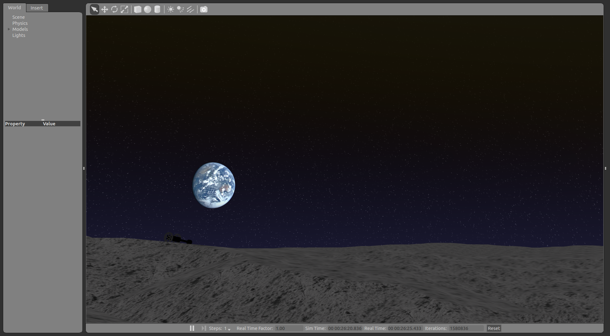
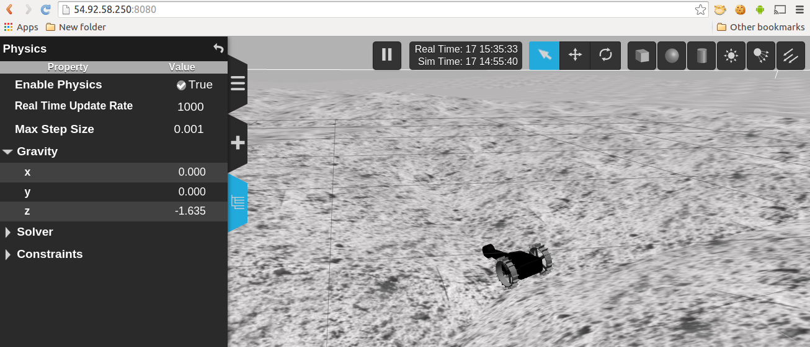

Hakuto `Build Status <https://magnum.travis-ci.com/tork-a/hakuto.svg?token=CnBWT8crLoonzXSDK29D&branch=master)](https://magnum.travis-ci.com/tork-a/hakuto>`_
================================================================================================================================================================

ROS package suite for the lunar rovers at `Hakuto project <http://lunar.xprize.org/teams/hakuto>`_, a `Google XPRIZE <http://lunar.xprize.org/teams/astrobotic>`_ competitor.

.. contents:: Table of Contents
   :depth: 2
.. sectnum::

Overview
==========

This document is targetted for the system administrators who install and maintain the Hakuto Tetris simulation web application server.

See `../../README.md <https://github.com/tork-a/hakuto/blob/master/README.md>`_ for the package overview and the simulation instruction for the end user.

System structure
-----------------

.. image:: https://docs.google.com/drawings/d/1gUGrRwlmaz8qguWtRnboQy1WlMI3IshyxxX92F5uueQ/pub?w=877&amp;h=344"

Packages in use
---------------

We're going to install the following packages. You don't need to explore each one of them now, but later you may want to. Then open links and take a look at the manifest file.

* `tetris_description <https://github.com/tork-a/hakuto/blob/master/tetris_description/package.xml>`_
* `tetris_gazebo <https://github.com/tork-a/hakuto/blob/master/tetris_gazebo/package.xml>`_
* `tetris_launch <https://github.com/tork-a/hakuto/blob/master/tetris_launch/package.xml>`_

For web server system admins
=================================

Web server requirement
------------------------

 * Internet connection
 * Ubuntu Linux. 14.04 "Trusty" 64bit

  * Currently installation of web simulator is only limited to Ubuntu Linux (the limitation comes from `Gzweb`, web frontend of the physics simulator `Gazebo`).

 * `ROS Indigo Igloo <http://wiki.ros.org/indigo>`_

Hakuto package Installation
--------------------------------

Install via apt (RECOMMENDED)
~~~~~~~~~~~~~~~~~~~~~~~~~~~~~~~~~~~~

Let's install a few of the simulator's main components: `ROS <http://ros.org/>`_ (robotics middleware), `Gazebo <http://gazebosim.org/>`_ (dynamics simulation engine), `gzweb <http://gazebosim.org/gzweb>`_ (Gazebo's web frontend).

1. Install ROS.

See `ROS wiki <http://wiki.ros.org/indigo/Installation/Ubuntu>`_ for the detail to install `ROS Indigo` on Ubuntu linux 14.04 `Trusty`.::

  Ubuntu$ sudo sh -c 'echo "deb http://packages.ros.org/ros/ubuntu trusty main" > /etc/apt/sources.list.d/ros-latest.list'
  Ubuntu$ wget https://raw.githubusercontent.com/ros/rosdistro/master/ros.key -O - | sudo apt-key add -
  Ubuntu$ sudo apt-get update && sudo apt-get install ros-indigo-desktop-full ros-indigo-hakuto
  Ubuntu$ sudo rosdep init && rosdep update
  
  Ubuntu$ echo "### For ROS setting"
  Ubuntu$ echo "source /opt/ros/indigo/setup.bash" >> ~/.bashrc
  Ubuntu$ source ~/.bashrc

2. Install Hakuto ROS packages.
::

  Ubuntu$ sudo apt-get install ros-indigo-hakuto

Install via source
~~~~~~~~~~~~~~~~~~~~~~~~

The directory `~/catkin_ws/` will be used as a source directory for this instruction.

1. Download `hakuto` ROS package.

  ::

  $ mkdir -p ~/catkin_ws/src && cd ~/catkin_ws/src && catkin_init_workspace
  $ git clone https://github.com/tork-a/hakuto.git

2. Install depended libraries.

  ::

  $ cd ~/catkin_ws
  $ rosdep install --from-paths src --ignore-src -r -y 

3. Now ready to build sources.

  ::

  $ catkin_make install && source install/setup.bash

4. Now let's install web front-end of the simulator, `Gzweb`. Follow the `official installation steps <http://gazebosim.org/gzweb#gzweb_installation>`_. Go through until `Clone the repository and build` section (ie. Stop before `Running gzserver, gzweb server, and WebGL client` section). Select `./deploy.sh -m`.

5. Place the necessary 3D model files of lunar surface by running the following commands.

  `%HOME_GZWEB%` is where you intalled `Gzweb`.

  ::

  $ cd %HOME_GZWEB%/http/client/
  $ mkdir assets         (create `assets` folder in case it doesn't exist)
  $ ln -fs `rospack find tetris_description`/models/tetris/ .
  $ cd %HOME_GZWEB%/http/client/assets     (`assets` folder may not exist. If so, create it)
  $ ln -fs `rospack find tetris_gazebo`/models/apollo15_landing_site_1000x1000 .

6. Add a trick to show the earth in the sky.

By default, the moon appears in the sky (I know how strange you feel since we're simulating lunar surface). 

::

  $ cd /usr/share/gazebo-2.2/media/skyx/
  $ sudo cp `rospack find tetris_gazebo`/worlds/earth_from_moon_20071113_kaguya_03l.png .
  $ sudo cp SkyX_Moon.png SkyX_Moon.png.org
  $ sudo ln -sf earth_from_moon_20071113_kaguya_03l.png SkyX_Moon.png

NOTE: Directory `/usr/share/gazebo-2.2/media/skyx/` may vary depending on the version of Gazebo, or also for Gzweb (at the time of writing this is not tested on `Gzweb` yet). In that case find `media/skyx` directory and apply the same change.

Also modify `SkyX_Moon.fragment` file in the same directory (see `this question <http://answers.gazebosim.org/questions/8401>`_ for the discussion if necessary).

::

    $ diff /usr/share/gazebo-2.2/media/skyx/SkyX_Moon.fragment.org /usr/share/gazebo-2.2/media/skyx/SkyX_Moon.fragment
    60c60
    < 	haloIntensity = pow(haloIntensity, uMoonPhase.z);
    ---
    > 	haloIntensity = pow(0.0, uMoonPhase.z);

  `.fragment` file seems to not work right with some comment-out formats; e.g. do not use `#` or it just didn't show the earth at all.

7. Prepare joystick keypad (for tele-operation)

 Tele-operation is done by using `keyboardteleopjs <http://wiki.ros.org/keyboardteleopjs>`_ that accepts command input from the keyboard through web browser. Put a `joystick.html` file under the `docroot` of your web server. In this document we use `/var/www/` for `apache` in this document. ::
  
  $ cp `rospack find tetris_launch`/www/joystick.html /var/www/

 You might need to edit the file using your web server's IP address, and the name of `Twist` topic. Do that by following `the tutorial for keyboard teleop <http://wiki.ros.org/keyboardteleopjs/Tutorials/CreatingABasicTeleopWidgetWithSpeedControl>`_.

Run the web simulator server 
--------------------------------

Run Gzweb, Gazebo on web server. You need to open multiple terminals and run the following. We encourage you to use `tmux` tools ( if you run `tmux a`, you can attach to existing shells, C-b D will detach from tmux)

* Terminal-1: Run simulation engine, Hakuto simulation modules.
* Terminal-2: Run web frontend for the simulation engine. 

 ::

  terminal-1$ roslaunch tetris_launch demo.launch gui:=false kbteleop:=false
  terminal-2$ DISPLAY=:0.0 ROS_MASTER_URI=http://%WEBSERVER_IPADDR%:13311 ROS_IP=%WEBSERVER_IPADDR% %HOME_GZWEB%/start_gzweb.sh &

  (Example)

  terminal-2$ DISPLAY=:0.0 ROS_MASTER_URI=http://54.92.58.250:13311 ROS_IP=54.92.58.250 /home/ubuntu/gzweb/start_gzweb.sh &

Troubleshoot server
--------------------

When something is wrong...
~~~~~~~~~~~~~~~~~~~~~~~~~~~~~~~~

On Ubuntu, check if all the necessary processes are running. Example::

  $ ps -ef | grep ros
  ubuntu    4351  2660  0 Jan14 pts/10   00:15:08 /usr/bin/python /opt/ros/indigo/bin/roscore
  ubuntu    4363  4351  0 Jan14 ?        00:19:58 /usr/bin/python /opt/ros/indigo/bin/rosmaster --core -p 11311 __log:=/home/ubuntu/.ros/log/3e773a72-9c0c-11e4-ad41-0a43be0c09e0/master.log
  ubuntu    4376  4351  0 Jan14 ?        00:23:56 /opt/ros/indigo/lib/rosout/rosout __name:=rosout __log:=/home/ubuntu/.ros/log/3e773a72-9c0c-11e4-ad41-0a43be0c09e0/rosout-1.log
  ubuntu    4450  2808  0 Jan14 pts/12   00:14:37 /usr/bin/python /opt/ros/indigo/bin/roslaunch tetris_gazebo tetris_world.launch gui:=false
  ubuntu    4482  4450  0 Jan14 ?        00:00:00 /bin/sh /opt/ros/indigo/lib/gazebo_ros/gzserver /opt/ros/indigo/share/tetris_gazebo/worlds/apollo15_landing_site.world __name:=gazebo __log:=/home/ubuntu/.ros/log/3e773a72-9c0c-11e4-ad41-0a43be0c09e0/gazebo-1.log
  ubuntu    4490  4482 28 Jan14 ?        5-03:44:53 gzserver /opt/ros/indigo/share/tetris_gazebo/worlds/apollo15_landing_site.world __name:=gazebo __log:=/home/ubuntu/.ros/log/3e773a72-9c0c-11e4-ad41-0a43be0c09e0/gazebo-1.log -s /opt/ros/indigo/lib/libgazebo_ros_paths_plugin.so -s /opt/ros/indigo/lib/libgazebo_ros_api_plugin.so
  ubuntu    4744  3306  0 Jan14 pts/16   00:15:11 /usr/bin/python /opt/ros/indigo/bin/roslaunch rosbridge_server rosbridge_websocket.launch
  ubuntu    4762  4744  7 Jan14 ?        1-08:06:14 python /opt/ros/indigo/lib/rosbridge_server/rosbridge_websocket __name:=rosbridge_websocket __log:=/home/ubuntu/.ros/log/3e773a72-9c0c-11e4-ad41-0a43be0c09e0/rosbridge_websocket-1.log
  ubuntu    4763  4744  7 Jan14 ?        1-06:59:59 python /opt/ros/indigo/lib/rosapi/rosapi __name:=rosapi __log:=/home/ubuntu/.ros/log/3e773a72-9c0c-11e4-ad41-0a43be0c09e0/rosapi-2.log
  ubuntu   13117 11159  7 21:23 pts/4    00:00:05 python /opt/ros/indigo/lib/teleop_twist_keyboard/teleop_twist_keyboard.py cmd_vel:=tetris/cmd_vel
  ubuntu   13181 12924  0 21:24 pts/18   00:00:00 grep --color=auto ros

For Developers
===============

As we have seen, Hakuto lunar simulation is tailored to be run on web server powered by `Gzweb`. Desktop version of simulator `Gazebo`, however, is more powerful and stable, which is more recommended for development purpose. Follow this section in that case.

`As in the system diagram <https://github.com/tork-a/hakuto/blob/doc/tutorial/tetris_launch/doc/sysadmin.rst#system-structure>`_, simulator consists of two components: simulation core (`Gazebo`) and web user interface (`Gzweb`). Except improvements about userability, changes are most likely prone to the simulation engine. That said, experiments for those works can be done with the desktop simulator, Gazebo, and once it looks good then you can employ the changes on Gzweb.

Source code of Hakuto package is opensourced at github repository: https://github.com/tork-a/hakuto

Run on Gazebo, desktop simulator
---------------------------------------------

`Desktop simulator version of Gazebo <http://gazebosim.org/>`_ should be already installed by the previous steps (`rosdep`, in particular). We still need some customization.

Run simulation on Gazebo
~~~~~~~~~~~~~~~~~~~~~~~~~~~~~~~~~~~~

::

 $ roslaunch tetris_launch demo.launch gui:=true

* NOTE-1: 1st time run on a computer, internet access is required to download model files for Gazebo.
* NOTE-2: `GAZEBO_MODEL_PATH` takes absolute path.

Customize server packages
------------------------------

To user custom lunar surface model
~~~~~~~~~~~~~~~~~~~~~~~~~~~~~~~~~~~~

Currently the environment model of lunar surface is placed under `tetris_gazebo/models <https://github.com/tork-a/hakuto/tree/master/tetris_gazebo/models/apollo15_landing_site_1000x1000>`_ directory (This is a temporary hack until `an enhancement request to the Gazebo <https://bitbucket.org/osrf/gazebo_models/pull-request/124/add-apollo15_landing_site/diff>`_ is accepted). 

To build your own environment model for Gazebo, follow `the Gazebo's tutorial <http://gazebosim.org/tutorials?cat=build_world>`_.

To replace the environment model with what you have,

1. Create the environment model (`.sdf` file)
2. Put the model under `tetris_gazebo/models` directory
3. Edit `.world file <https://github.com/tork-a/hakuto/blob/master/tetris_gazebo/worlds/apollo15_landing_site.world>`_ to include the custom model directory
4. Edit `tetris_gazebo/launch/tetris_world.launch <https://github.com/tork-a/hakuto/blob/master/tetris_gazebo/launch/tetris_world.launch>`_ to include the custom model directory

To change physical parameter (gravitational acceleration)
~~~~~~~~~~~~~~~~~~~~~~~~~~~~~~~~~~~~~~~~~~~~~~~~~~~~~~~~~~~~

Click on the 3rd tab from the top on the left and you'll see `Physics` --> `Gravity` pane. There you have a control over XYZ value. In the figure, gravity in the vertical direction is 1/6 of what's on earth.

To change 3D models (robot and environment)
~~~~~~~~~~~~~~~~~~~~~~~~~~~~~~~~~~~~~~~~~~~~~~~~~~~~~~~~~~~~

The simulated robot program is written in ROS-capable format and thus follows its 3D modelling format called `URDF <http://wiki.ros.org/urdf>`_. While `Gazebo <http://gazebosim.org/>`_ simulation engine that Hakuto Simulator is based upon is capable of `URDF` format.
Modifying the robot or the environment (lunar surface) is possible by manipulating URDF files as in the following sub sections.

To change the robot's 3D model
***********************************************

The 3D appearance and dynamics parameters of the robot is described in `tetris.urdf.xacro <https://github.com/tork-a/hakuto/blob/master/tetris_description/urdf/tetris.urdf.xacro`_.

- Body mass, size are defined at the beginning:

 ::

  <xacro:property name="body_mass" value="1.89"/>
  <xacro:property name="wheel_width" value="0.04"/>
  <xacro:property name="wheel_diameter" value="0.2"/>
  <xacro:property name="wheel_separation" value="0.25"/>
  <xacro:property name="wheel_mass" value="0.425"/>
  <xacro:property name="tail_mass" value="0.162"/>
  <xacro:property name="ns" value="tetris" />

- Each joint and link is defined in separate xml tags, `joint` and `link`, respectively. Appearance of the links are implemented in external files, which are referenced from `mesh` tag.

To change physics parameter in the simulation
************************************************

The physics of the environment is defined in `tetris.gazebo.xacro <https://github.com/tork-a/hakuto/blob/master/tetris_description/urdf/tetris.gazebo.xacro>`_ file, the content of which at the time of the writing (Mar 2015) is cited below. Most of each xml tag should be pretty much self-explanatory, if not they are documented on `ROS wiki <http://wiki.ros.org/urdf/XML>`_.

::

  <?xml version="1.0"?>
  <robot>
    <!-- ros_control plugin -->
    <gazebo>
      <plugin name="gazebo_ros_control" filename="libgazebo_ros_control.so">
        <robotNamespace>/${ns}</robotNamespace>
        <robotSimType>gazebo_ros_control/DefaultRobotHWSim</robotSimType>
      </plugin>
    </gazebo>
  
    <gazebo>
      <plugin name="differential_drive_controller" filename="libgazebo_ros_diff_drive_fixed.so">
        <alwaysOn>true</alwaysOn>
        <updateRate>100</updateRate>
        <leftJoint>right_wheel_joint</leftJoint> <!-- intentionally reverted -->
        <rightJoint>left_wheel_joint</rightJoint>
        <wheelSeparation>${wheel_separation}</wheelSeparation>
        <wheelDiameter>${wheel_diameter}</wheelDiameter>
        <wheelTorque>0.8</wheelTorque>
        <wheelAcceleration>0.05</wheelAcceleration>
        <commandTopic>/${ns}/cmd_vel</commandTopic>
        <odometryTopic>/${ns}/odom</odometryTopic>
        <odometryFrame>odom</odometryFrame>
        <robotBaseFrame>base_footprint</robotBaseFrame>
        <publishWheelTF>true</publishWheelTF>
        <publishWheelJointState>true</publishWheelJointState> 
      </plugin>
    </gazebo>
  
    <gazebo reference="base_link">
      <mu1>0.1</mu1>
      <mu2>0.1</mu2>
      <material>Gazebo/Black</material>
    </gazebo>
    <gazebo reference="tail_link">
      <mu1>0.1</mu1>
      <mu2>0.1</mu2>
      <material>Gazebo/White</material>
    </gazebo>
    <gazebo reference="right_wheel">
      <mu1>0.8</mu1>
      <mu2>0.8</mu2>
      <material>Gazebo/Grey</material>
      <kp>100000000.0</kp>
      <kd>1.0</kd>
   </gazebo>
    <gazebo reference="left_wheel">
      <mu1>0.8</mu1>
      <mu2>0.8</mu2>
      <material>Gazebo/Grey</material>
      <kp>100000000.0</kp>
      <kd>1.0</kd>
   </gazebo>
  
  </robot>

Here are some task-oriented guidance for the xml tags.

- Make robot climb uphills more steadily: 

 Increase torque by `wheelTorque` and friction coefficient `mu1`, `mu2` are effective.

- Stop robot to jump around: 

 Restitution coefficient is currently not in use with this robot (although its available in URDF). So far it's manipulated by modifying friction coefficient.

